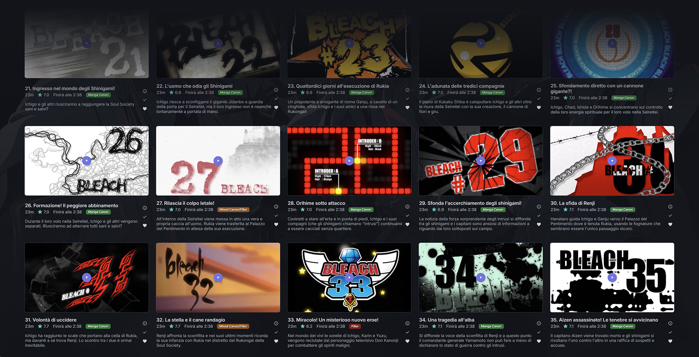

# Ronin: An Anime Toolkit for Jellyfin


---
Ronin is a Jellyfin plugin designed as a focused toolbox to improve, expand, and refine the anime management experience on your media server. It provides a set of opt-in tasks that help normalize anime libraries, where metadata providers, season layouts, and episode numbering are often inconsistent or misleading.

Ronin is built to evolve over time, with new features added incrementally as dedicated, specialized tools.

## Prerequisites

- This plugin is currently compatible with Jellyfin `10.10.x` (and newer).
- The following plugin must be installed. Please follow its specific installation guide:
  * [File Transformation](https://github.com/IAmParadox27/jellyfin-plugin-file-transformation) by [IAmParadox27](https://github.com/IAmParadox27) (v2.5.2.0 or higher).


- Ronin relies on external providers to function correctly. At least one of the following must be installed and configured in Jellyfin:

  * TheTVDB
  * AniDB

  *Note: Most tasks prioritize TVDB and will fall back to AniDB when necessary. If neither provider is available or correctly mapped, certain features may be skipped or only partially applied.*
  
- Libraries containing your anime series should already be scanned and visible in Jellyfin before running any Ronin tasks.

## Installation

1. Add the following manifest URL to your Jellyfin **Plugin Repositories**:
```text
https://raw.githubusercontent.com/ahza-code/jellyfin-plugin-ronin/main/manifest.json

```
2. Navigate to the **Catalog** and refresh the page.
3. Locate and install **Ronin**.
4. **Restart** your Jellyfin server.

## Features

### Canon, Mixed, and Filler Episode Detection

Ronin includes a scheduled task that analyzes anime episodes to determine their status: **Canon**, **Mixed Canon/Filler**, or **Filler**.

This information is stored as metadata and can be displayed as a visual badge on individual episodes. This makes tracking and filtering content significantly easier, especially for long-running series.



The appearance of these badges is also customizable.

*This task is designed for regular use and is safe to re-run.*

### Anime Episodes Management

Managing anime libraries can be frustrating when metadata providers use different season structures. Ronin provides two powerful tools to bring order to your anime collection:

* **Global Anime Re-Org (Aired Seasons)**: This task redistributes episodes into seasons based on the official TVDB Aired Order. It is the go-to tool if you prefer a seasonal structure (Season 1, Season 2, etc.) over one endless season, allowing you to stay organized without losing the metadata accuracy provided by databases like AniDB—which typically handle anime as single-season entities since many series canonically do not use season divisions.
* **Global Anime Re-Org (Force Single Season)**: If you prefer a "continuous" library, this task merges all episodes of an anime series into a single Season 1. It keeps everything neat and tidy in one place while leaving your Specials (Season 0) untouched.

Both tasks are opt-in and will not run automatically by default. They are designed to modify only standard episodes, leaving your Specials (Season 0) completely intact.
These tasks affect all series identified as "Anime" by the plugin. You can further customize [how the plugin targets your anime series](#anime-identification) in plugin's settings.

> **Note:** Both features are currently experimental. It is highly recommended to use with caution and set the [tag-filtering system](#customizing-the-target-tag) in the plugin's preferences to test them on a single series before running them library-wide.

### Anime Identification

To ensure tasks only run on the intended content, Ronin uses a global identification system to determine which series in your library are treated as "Anime." You can customize this behavior in the plugin settings to match your library's organization style.

You can choose between four **Identification Modes**:

* **Genre (Default)**: Any series with the "Anime" genre is targeted.
* **Tag**: Only series containing a specific Tag (default is `Anime`) are targeted.
* **Genre or Tag**: Targets a series if it has either the "Anime" genre or the specified Tag.
* **Genre and Tag**: Targets only series that have both the "Anime" genre and the specified Tag (best for high precision).

#### Customizing the Target Tag

If you prefer to use a custom tag instead of the default `Anime` (for example, `Ronin-Target`), you can change the **Anime Target Tag** field in the preferences.
This can be useful if you want to run a task only on specific Series.

> **Note**: Identification settings are global. All Ronin tasks (Re-Org, Filler Scanning, etc.) will target the same set of series based on these rules.

## Future Plans
Ronin is an evolving project. I plan to keep improving the existing tools and adding new features whenever I have the chance or when a specific need arises. If you have an idea for a feature that would make managing anime easier, or if you notice something that could be improved, feel free to reach out or open an issue. This toolkit is meant to grow based on what the community actually needs.n.

## License

This project is licensed under the **GNU General Public License v3.0**. 

You are free to use, modify, and distribute this software, provided that all changes remain open-source under the same license. For more details, see the [LICENSE](LICENSE) file in this repository.

---

*Developed with love for the Anime community.*
